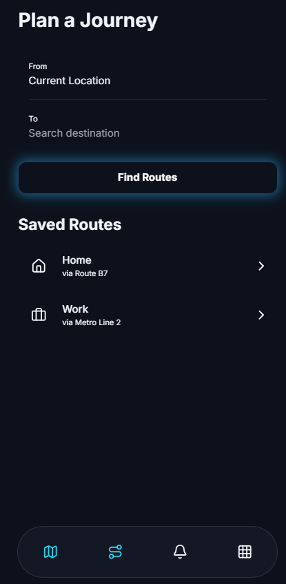

# Protoype-Navify
Navify is a smart transport tracking system prototype designed for local cities. It enables real-time bus/vehicle tracking, shortest route suggestions, traffic-based delay alerts, and live ETA for passengers. The system also provides fleet management features for admins, improving safety, fuel efficiency, and commuter convenience.

## 🌐 Live Demo
👉 [Click here to view Navify Prototype](https://sankalphq.github.io/Prototype-Navify/)

---

## 🛠 Tech Stack
- *HTML5* – Structure of the prototype  
- *CSS3* – Styling and layout  
- *JavaScript (Vanilla JS)* – Functionality & interactivity  
- *Tailwind CSS* – Utility-first CSS framework for rapid UI design  

---

  
Home page UI of Navify prototype

  
Transport tracking interface

---

## ✨ Features
- 🚍 Real-time transport prototype UI  
- 📍 Map & tracking interface (design stage)  
- 📱 Responsive design with Tailwind  
- ⚡ Simple, fast, and lightweight  

---
